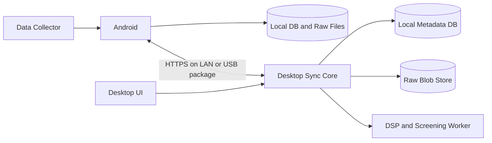
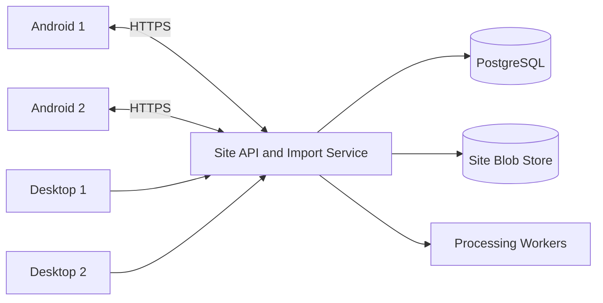
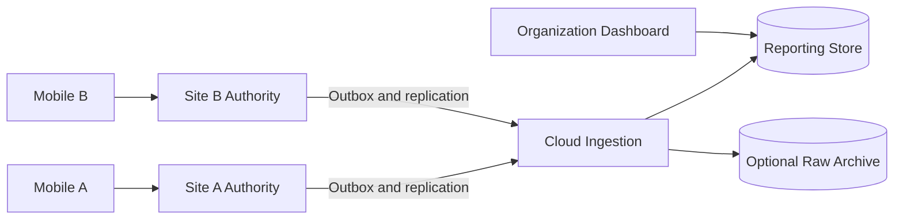
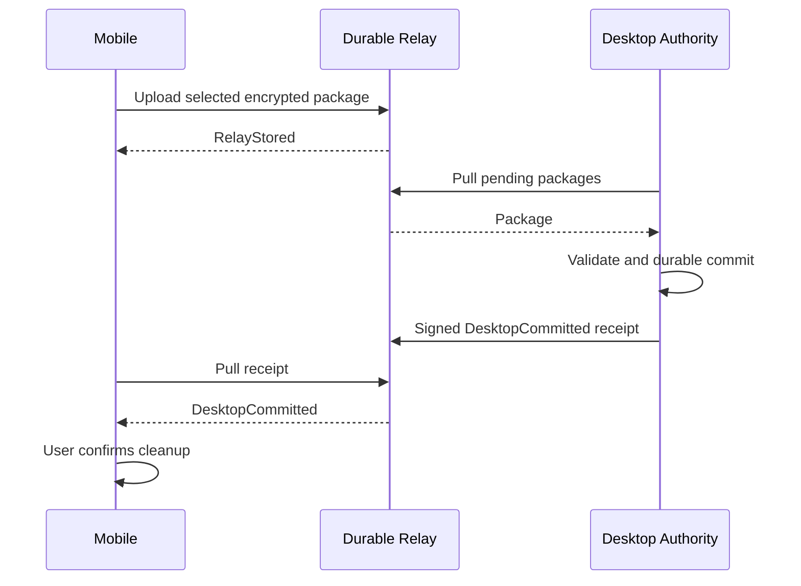
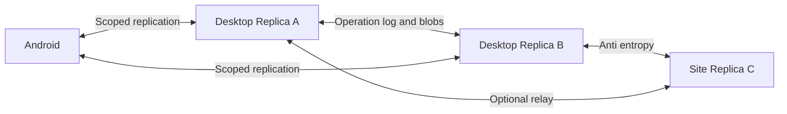

# شش مدل معماری برای SeeNora

## A — دسکتاپ مرجع و موبایل Offline-first

**مناسب برای Beta و یک دسکتاپ مسئول هر کارخانه یا دیتابیس.** Desktop Core یک Modular Monolith است: Asset Catalog، Import/Sync، Measurement Store، Processing، Screening و Reporting مرزهای ماژولی روشن دارند، ولی برای شروع سرویس‌های مستقل شبکه‌ای نیستند.

**جریان:** دسکتاپ شاخه و نسخه درخت را منتشر می‌کند؛ موبایل آن را Pull و محلی ذخیره می‌کند. پس از برداشت، موبایل داده انتخاب‌شده را Push می‌کند. Importer دسکتاپ صحت Blob و Metadata را بررسی و Receipt صادر می‌کند. در USB همان بسته و Receipt با فایل مبادله می‌شوند.

**مالکیت:** Desktop نویسنده Tree/Spec؛ هر موبایل تولیدکننده Measurementهای خودش؛ موبایل مالک ترجیحات محلی. چند موبایل روی یک Point برداشت کنند، دو مشاهده معتبر ایجاد می‌شود و تعارض overwrite نداریم.

**نسخه‌بندی:** revision عددی مرجع، ETag برای تغییرات رقابتی داخل دسکتاپ، cursor برای Delta، unique Measurement ID. Vector Clock لازم نیست.

**ذخیره و اجرا:** SQLite محلی برای Metadata در استقرار تک‌ماشین، فایل‌های immutable برای سیگنال؛ سرویس Sync می‌تواند هنگام بسته‌بودن UI زنده بماند. نصب، Firewall، پورت، مجوز و شروع سرویس باید جزئی از Installer باشند. PC خاموش یعنی دریافت شبکه‌ای ممکن نیست؛ Outbox موبایل منتظر می‌ماند.

**مزیت:** نزدیک‌ترین مدل به PRD، کمترین بار عملیاتی، کارکرد کامل محلی، عیب‌یابی ساده. **هزینه/ریسک:** دیسک یا خود PC نقطه خرابی است، اتصال از اینترنت پشت NAT بدون واسطه دشوار، چند دسکتاپ مشترک نیازمند تغییر استقرار. Backup لازم است؛ صرف Receipt از خرابی بعدی دیسک محافظت نمی‌کند.

**انتخاب A وقتی:** یک مرجع کافی است و انتقال هنگام دسترسی به PC قابل قبول است. **از A عبور کنید وقتی:** دسترس‌پذیری PC مانع عملیات است یا چند کارشناس باید هم‌زمان روی داده مشترک کار کنند.

## B — سرور محلی کارخانه با کلاینت‌های دسکتاپ و موبایل

**مناسب برای چند دسکتاپ و چند تکنسین در یک سایت بدون وابستگی به اینترنت.** مرجع منطقی هنوز مرکزی است، ولی از کامپیوتر کارشناس به سرویس سایت منتقل می‌شود.

**جریان:** موبایل Tree را از Site API می‌گیرد و Measurement را همان‌جا تحویل می‌دهد؛ Desktop UI داده و Trend را از API می‌خواند. ارسال اعلان تغییر از WebSocket یا SSE اختیاری است و Pull با cursor مسیر بازیابی باقی می‌ماند.

**سازگاری:** تراکنش پایگاه مرکزی و Optimistic Concurrency برای Tree؛ نوشتن‌های رقابتی با expected_revision رد یا بازبینی می‌شوند. RPC شبکه را با دسترسی مستقیم کلاینت‌ها به دیتابیس جایگزین نکنید. Vector Clock برای درخواست‌های آنلاین چند دسکتاپ لازم نیست.

**قطع شبکه سایت:** موبایل برداشت را ادامه می‌دهد. دسکتاپ می‌تواند cache خواندنی داشته باشد؛ ویرایش Tree تا اتصال متوقف شود یا به‌صورت draft بدون ادعای اعمال سراسری نگه‌داری شود. پذیرش commit مستقل آفلاین روی چند دسکتاپ یعنی ورود به E.

**مزیت:** مرجع مشترک روشن، Backup و کنترل دسترسی متمرکز، پردازش مستقل از UI. **هزینه/ریسک:** تهیه و نگهداری سرور، UPS، patching، گواهی و پایش. HA اختیاری با primary/standby و fencing طراحی شود؛ صرفاً افزودن دو سرور مستقل HA ایجاد نمی‌کند.

**نکته دامنه:** PRD از تأیید Desktop سخن می‌گوید؛ پذیرش Site Server به‌عنوان مرجع نهایی و مجوز پاک‌سازی باید در ADR ثبت شود. نمایش نتیجه روی UI دسکتاپ لازم نیست لحظه صدور Receipt باشد، ولی داده باید در مرجع مورد توافق بادوام باشد.

## C — سایت مستقل با تجمیع ابری

**مناسب برای چند کارخانه و گزارش سازمانی، بدون از دست دادن استقلال سایت.** هر سایت مرجع دارایی‌های خودش است؛ Cloud داده منتخب را برای گزارش، Backup یا خدمات آینده دریافت می‌کند.

**مالکیت:** برای هر Asset دقیقاً یک owning_site تعریف می‌شود. Cloud تغییر را به مرجع مالک پیشنهاد می‌دهد؛ مالکیت هم‌زمان مبهم ممنوع. انتقال مالکیت بین سایت‌ها یک workflow با epoch جدید و توقف مرجع قبلی است.

**داده ابری:** می‌توان فقط Feature، Alert و Metadata را ارسال کرد و Raw را هنگام نیاز دریافت کرد؛ این یک سیاست هزینه/حریم داده است و برای Backup کامل کافی نیست. تجمیع «Feature-only» نباید امکان بازیابی Raw را وعده دهد.

**تحویل:** Receipt سایت برای پاک‌سازی موبایل کافی است فقط اگر سایت مرجع نهایی توافق‌شده باشد. replication به Cloud وضعیت دیگری مانند CloudReplicated دارد. در قطع اینترنت گزارش مرکزی کهنه می‌شود، ولی مسیر سایت کار می‌کند. UI زمان آخرین Sync را نشان دهد.

**مزیت:** رشد چندسایتی، کاهش وابستگی میدان به اینترنت، مرزبندی خطای سایت‌ها. **هزینه/ریسک:** دو لایه عملیات و امنیت، schema compatibility طولانی‌تر، هزینه Raw و خروج شبکه، تعریف دقیق مالکیت و حذف.

**چرا فعلاً اولویت پایین‌تر؟** PRDها مرجع Desktop می‌خواهند و نیاز Dashboard چندسایتی هنوز اثبات نشده است. این گزینه مسیر رشد است، نه الزام Beta.

## D — مرجع Desktop با Relay اینترنتی بادوام

**مناسب برای ارسال با Cellular، NAT و هم‌زمان آنلاین نبودن موبایل و دسکتاپ.** Cloud در این مدل صندوق تحویل است و مالک Tree یا مرجع نهایی History نمی‌شود.

**Tree در جهت برگشت:** Desktop نسخه مأموریت را روی Relay می‌گذارد؛ موبایل Pull می‌کند. هر دو فقط ارتباط خروجی HTTPS برقرار می‌کنند. Push notification فقط خبر «تغییری هست» را می‌رساند.

**حالت شکست مهم:** Upload موفق به Relay و PC خاموش، وضعیت RelayStored است؛ نسخه موبایل هنوز حذف‌پذیر نیست. اگر کاربر انتظار خالی‌شدن گوشی در همین مرحله را دارد، باید تعریف مرجع نهایی به Cloud تغییر کند؛ این تغییر محصول است، نه یک بهینه‌سازی شبکه.

**امنیت:** Package برای مقصد pairشده رمز شود و Receipt مقصد قابل احراز باشد. مدیریت کلید، تعویض PC و بازیابی کلید باید طراحی شوند. TLS فقط مسیر ارتباط را محافظت می‌کند؛ الزاماً Relay را از دیدن محتوا محروم نمی‌کند.

**مزیت:** اینترنت بدون بازکردن پورت PC، تحویل غیرهم‌زمان، قابلیت افزودن به A. **هزینه/ریسک:** هزینه نگهداری بسته، expiration و Retry، کاربرانی با اینترنت محدود، بازیابی کلید و حساب. حذف Relay بعد از TTL نباید تنها نسخه داده را از بین ببرد؛ موبایل تا Receipt نهایی نگه می‌دارد.

## E — Local-first چندمرجعی و توزیع‌شده

**مناسب فقط وقتی چند دسکتاپ باید روی یک داده مرجع، مستقل و آفلاین commit کنند.** همه replicaها می‌توانند عملیات بسازند و بعداً تبادل کنند. این قوی‌ترین پوشش آفلاین و پرهزینه‌ترین مدل برای درستی است.

**همگام‌سازی:** Operation Log، نسخه‌های علّی، Anti-entropy و تبادل Blobها. Measurementهای immutable با مجموعه IDها همگرا می‌شوند. Metadata mutable به Vector Clock/Dotted Version Vector و سیاست Merge نیاز دارد؛ CRDT برای مجموعه برچسب یا annotation مستقل قابل بررسی است.

**محدودیت اصلی:** بدون هماهنگی نمی‌توان همواره هم نوشتن آفلاین همه replicaها را پذیرفت و هم یکتایی جهانی Tag یا بدون‌چرخه‌بودن Tree را هنگام تمام تغییرات تضمین کرد. نام مشابه، جابه‌جایی متقابل Parent و حذف هم‌زمان با ویرایش نیازمند تعارض قابل مشاهده یا محدودکردن نوشتن‌اند. همگرایی بیتی کافی نیست.

**سیاست قابل اجرا:** شعبه‌های مستقل مالک‌های جدا داشته باشند؛ تغییر ساختاری حساس نیازمند مرجع هماهنگ باشد؛ ویرایش هم‌زمان فیلد فنی به Conflict Inbox برود. این محدودسازی بخشی از مزیت معماری کاملاً چندمرجعی را کاهش می‌دهد ولی معنای داده را حفظ می‌کند.

**Receipt و حذف:** «یک peer دریافت کرد» الزاماً انتقال به مرجع مورد نظر محصول نیست. باید مقصد archival authority یا حداقل replication policy مشخص شود. Vector Clock دوام داده را تضمین نمی‌کند.

**هزینه/ریسک:** actor lifecycle، tombstone، حذف امن، schema migration، replica قدیمی، history حجیم، UI تعارض و کنترل دسترسی آفلاین. برای Beta سه‌ماهه بدون نیاز قطعی پیشنهاد نمی‌شود.

## F — موتور Replication آماده با قواعد دامنه اختصاصی

**مناسب برای تیمی که می‌خواهد بخشی از زیرساخت Sync را آماده بگیرد.** نمونه قابل ارزیابی، موتور document replication مانند CouchDB و کلاینت سازگار است. این گزینه انتخاب فناوری است و می‌تواند زیر A، B یا E قرار بگیرد؛ جایگزین مستقل همه تصمیم‌های توپولوژی نیست.

در CouchDB تعارض revisionها قابل نگهداری است و انتخاب deterministic یک winner لزوماً حل معنایی تعارض نیست. بنابراین قواعد Tree، Axis Mapping و Threshold باید در لایه دامنه باقی بمانند. [مستند رسمی تعارض CouchDB](https://docs.couchdb.org/en/stable/replication/conflicts.html)

**طرح پیشنهادی PoC:** Metadata کوچک به صورت document، Raw خارج از آن به‌صورت Blob با hash، Scope مجاز در سمت سرور enforce شود، Measurement با ID ثابت immutable باشد، و حذف موبایل با Receipt اختصاصی دامنه کنترل شود.

**مزیت:** استفاده از checkpoint و replication آماده؛ کاهش بخشی از کد زیربنایی. **ریسک:** سازگاری واقعی Android و Desktop، هزینه/مجوز محصول انتخابی، conflict semantics، filtered replication و attachmentهای بزرگ. Couchbase Lite را بدون بررسی، کلاینت جایگزین CouchDB فرض نکنید؛ اکوسیستم و قرارداد سازگاری باید جدا تأیید شود.

**Gate انتخاب:** آزمون قطع ارتباط، فایل حجیم، scope isolation، conflict، ارتقای schema، export مستقل از vendor و سناریوی USB. اگر فایل USB به یک مسیر جدا با رفتار متفاوت تبدیل شود، مزیت موتور آماده ممکن است از بین برود.

## گزینه‌های مکمل و گزینه‌های نامناسب برای شروع

| روش | کاربرد ممکن | علت محدودیت برای SeeNora |
|---|---|---|
| Cloud-only با cache موبایل | مشتری با اینترنت قابل اتکا و Cloud مجاز | مدیریت و تحلیل آفلاین دسکتاپ و USB باید دوباره طراحی شود؛ با دامنه موجود تطابق کامل ندارد |
| Pure USB / Sneakernet | سایت بدون شبکه؛ حالت آفلاین کامل A | تأخیر انسانی، نیاز به انتقال Receipt برگشتی و کنترل نسخه |
| P2P روی LAN | انتقال مستقیم بدون Cloud | discovery، مجوز، firewall و مالکیت همچنان لازم‌اند |
| Event-driven داخلی | پردازش async و اطلاع‌رسانی | یک صف محلی بادوام ابتدا کافی است؛ Broker بزرگ پیش‌نیاز نیست |
| CQRS سبک | Feature/Trend قابل بازسازی از Raw | لازم نیست Event Sourcing کامل کل دامنه اجرا شود |
| Event Sourcing کامل | حسابرسی تغییرات بسیار پیچیده | هزینه replay، migration و snapshot؛ برای همه جدول‌ها توجیه ندارد |
| فایل SQLite مشترک روی SMB | ظاهراً سریع برای چند Desktop | جای API و موتور client/server نیست و ریسک فایل/قفل شبکه دارد |

برای چند کلاینت شبکه‌ای، راهنمای SQLite نیز موتور client/server را توصیه می‌کند؛ فایل SQLite در A روی همان میزبان Core باقی می‌ماند. [کاربردهای مناسب SQLite](https://www.sqlite.org/whentouse.html)