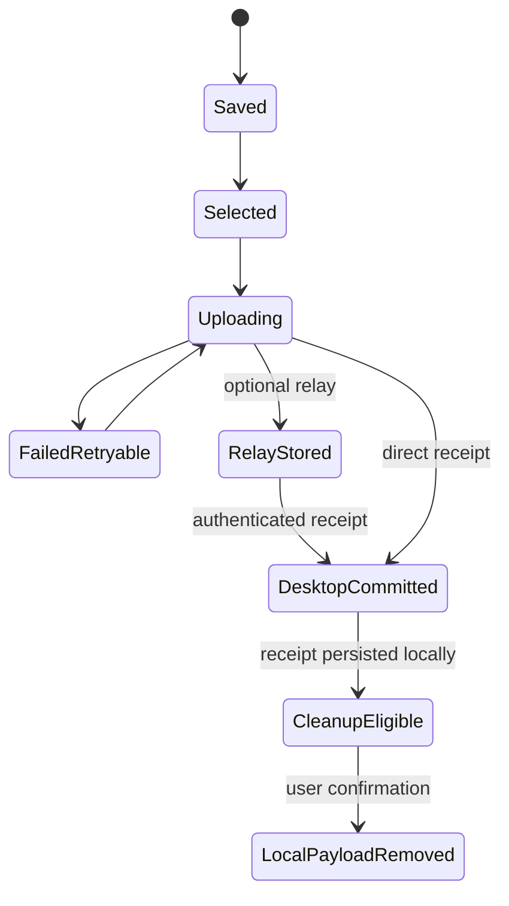

# قرارداد پیشنهادی ارتباط Android و Desktop

این سند یک قرارداد طراحی نسخه ۱ است؛ API موجود یا استاندارد اختصاصی منتشرشده SeeNora نیست. نام endpointها، اندازه chunk و timeoutها باید در Gate قرارداد بین تیم‌ها نهایی شوند. همین semantics باید روی LAN، Relay و USB برقرار باشد.

## انتخاب Transport

| گزینه | استفاده مناسب | تصمیم پیشنهادی |
|---|---|---|
| HTTPS + JSON + binary upload | Tree، وضعیت، ارسال Raw، debugging و versioning | مسیر اصلی v1 |
| WebSocket | اعلان و پیشرفت روی اتصال باز | اختیاری؛ جای log و Receipt نیست |
| SSE | اعلان یک‌طرفه Desktop/Site به client | جایگزین ساده برای notification |
| gRPC / Protobuf | قرارداد typed و ارتباط سرویس‌های کنترل‌شده | پس از بررسی stack و ابزار تیم؛ برای MVP الزامی نیست |
| MQTT | fleet messaging و ارتباط با broker موجود | broker و ACL اضافه می‌کند؛ QoS معادل commit دامنه نیست |
| WebRTC DataChannel | انتقال مستقیم از شبکه‌های متفاوت | signaling و احتمال relay؛ برای MVP پیچیدگی اضافی |
| USB package | محیط کاملاً آفلاین و مسیر جایگزین | مسیر رسمی مشترک با Importer شبکه |

WebSocket یک کانال ارتباطی دوطرفه می‌دهد؛ بازیابی پس از قطع، احراز هویت و تأیید ثبت داده باید در پروتکل برنامه تعریف شوند. [RFC 6455](https://www.rfc-editor.org/info/rfc6455/)

## کشف، Pairing و اعتماد

1. Desktop/Site یک endpoint و QR شامل `site_id`، `database_id`، `authority_id`، آدرس، fingerprint کلید و nonce یک‌بارمصرف کوتاه‌عمر نشان می‌دهد.
2. کاربر QR را اسکن و هویت مقصد را تطبیق می‌دهد. mDNS یا ورود دستی آدرس فقط برای discovery است و منبع اعتماد نیست.
3. موبایل کلید نصب خود را می‌سازد و طی channel احرازشده، درخواست Pairing می‌دهد. nonce یک‌بارمصرف و محدود به زمان و تعداد تلاش باشد.
4. مرجع credential محدود به سایت، دستگاه و scope صادر می‌کند؛ token خام در log یا QR دائمی نباشد.
5. تمام درخواست‌ها با TLS و credential معتبر انجام شوند. در شبکه محلی از trust onboarding/pinning کنترل‌شده استفاده شود، نه خاموش‌کردن validation گواهی.
6. Revoke و rotate مستقل از حذف داده محلی‌اند. دستگاه لغوشده نمی‌تواند داده تازه به مرجع تحویل دهد؛ داده موجود برای recovery باقی بماند.

در LAN بدون اینترنت، authority محلی باید بتواند auth را بررسی کند. اتکای انحصاری به login آنلاین یا license check ابری در زمان هر برداشت، با Offline-first ناسازگار است. مدت اعتبار آفلاین و سیاست plan تک/سه‌محوره باید با محصول مشخص شود.

## هویت و envelope مشترک

هر پیام حداقل `protocol_version`، `schema_version`، `site_id`، `database_id`، `authority_id`، `sender_installation_id` و `request_id` داشته باشد. `collector_id` شناسه سخت‌افزار اندازه‌گیری است و با شناسه گوشی فرق دارد. `authority_epoch` برای تشخیص تغییر مرجع/restore کنترل‌شده استفاده شود؛ epoch قدیمی نباید بدون بررسی به مرجع تازه اجازه overwrite بدهد.

نسخه‌های major ناسازگار رد شوند؛ فیلد اختیاری ناشناخته طبق قرارداد قابل صرف‌نظرکردن باشد، ولی نادیده‌گرفتن unit، encoding یا axis اجباری مجاز نیست. `capabilities` شامل اندازه chunk، encodingها و featureهای پشتیبانی‌شده در handshake تبادل شود.

## endpointهای پیشنهادی

| Method و Path | رفتار |
|---|---|
| `GET /v1/capabilities` | نسخه‌ها، محدودیت‌ها، شناسه مرجع و encodingها |
| `POST /v1/pairings` | تکمیل Pairing با nonce و public key |
| `GET /v1/assignments` | مأموریت‌ها و scopeهای مجاز دستگاه |
| `GET /v1/tree/snapshot?scope_id=...` | Snapshot صفحه‌بندی‌شده با watermark ثابت |
| `GET /v1/tree/changes?scope_id=...&cursor=...` | upsert/tombstone/remove-from-scope و cursor بعدی |
| `POST /v1/transfers` | ثبت manifest و دریافت transfer_id و Blobهای مفقود |
| `PUT /v1/transfers/{id}/blobs/{hash}/chunks/{index}` | ارسال idempotent یک chunk باینری |
| `GET /v1/transfers/{id}` | chunkهای دریافت‌شده و وضعیت هر Measurement |
| `POST /v1/transfers/{id}/commit` | validation نهایی، commit مستقل هر Measurement، Receipt |
| `GET /v1/measurements/{id}/receipt` | بازیابی Receipt بعد از قطع یا گم‌شدن ACK |
| `GET /v1/receipts?cursor=...` | دریافت Receiptهای مجاز، مخصوصاً در Relay |

Path سایت را از body به‌تنهایی معتبر ندانید؛ credential و resource scope باید با آن تطبیق داده شوند. hash موجود نباید امکان probing داده سایت دیگر را بدهد.

## نمونه manifest مختصر

مقادیر ID و hash زیر نمونه‌اند و برای ارسال واقعی باید شناسه و hash معتبر جایگزین شوند. Metadata کامل نمونه‌برداری در سند مدل داده تعریف شده است.

```json
{
  "protocol_version": "1.0",
  "schema_version": 1,
  "site_id": "site-01",
  "database_id": "db-01",
  "authority_id": "desktop-01",
  "authority_epoch": 1,
  "sender_installation_id": "android-install-17",
  "batch_id": "batch-uuid",
  "measurements": [
    {
      "measurement_id": "measurement-uuid",
      "session_id": "session-uuid",
      "mode": "ROOT",
      "point_id": "point-uuid",
      "tree_revision": 42,
      "collector_id": "collector-serial",
      "measured_at": "2026-09-30T08:12:00Z",
      "sample_rate_hz": 25600,
      "sample_count_per_axis": 256000,
      "encoding": "float32-le",
      "acceleration_unit": "m/s2",
      "axes": [
        {"axis": "X", "direction_id": "dir-h", "blob_sha256": "sha256-x"},
        {"axis": "Y", "direction_id": "dir-v", "blob_sha256": "sha256-y"},
        {"axis": "Z", "direction_id": "dir-a", "blob_sha256": "sha256-z"}
      ],
      "temperature": {"status": "VALID", "value": 42.1, "unit": "C"},
      "context_snapshot_sha256": "sha256-context",
      "measurement_manifest_sha256": "sha256-manifest"
    }
  ]
}
```

نمونه فرض می‌کند هر محور فایل جدا دارد. اگر interleaved استفاده شود، layout، stride و ترتیب محورها صریح باشند. hash manifest روی canonical encoding مصوب و **بدون فیلد hash خود manifest** محاسبه شود؛ JSON با ترتیب دلخواه کلیدها را به‌عنوان هویت محتوا hash نکنید. Blob hash بر bytes دقیق فایل انتقالی است. اگر compression اضافه شود، اندازه/encoding بازشده و checksum محتوای خام نیز مشخص شوند.

## الگوریتم انتقال شبکه‌ای

1. موبایل Measurementهای معتبر و انتخاب‌شده را از local transaction وارد Outbox می‌کند. انتخاب batch نباید ID Measurement را عوض کند.
2. `POST /transfers` با Idempotency-Key و hash درخواست ارسال می‌شود. همان key با body متفاوت خطا است. key باید در scope دستگاه و سایت نگهداری شود.
3. مقصد manifest را از نظر schema، permission، Node، اندازه و quota بررسی می‌کند؛ فقط فایل‌های مفقود درخواست می‌شوند.
4. فرستنده chunkها را می‌فرستد؛ پیشنهاد شروع آزمایش: ۱ تا ۴ MiB، نه الزام نهایی. هر chunk طول، index و checksum دارد.
5. chunk تکراری همسان پذیرفته شود؛ همان index با bytes متفاوت رد شود. بعد از reconnect وضعیت از مقصد خوانده شود، نه از حدس شمارنده UI.
6. مقصد فایل کامل را assemble، اندازه و SHA-256 نهایی را کنترل و به immutable storage منتقل می‌کند.
7. Importer تمام اجزای هر Measurement، mapping و Context را اعتبارسنجی می‌کند. commit در سطح Measurement اتمی است؛ تمام batch الزاماً اتمی نیست.
8. تراکنش DB رکورد Measurement، Inbox dedup، Receipt و job پردازش را ثبت می‌کند. Blobها پیش‌تر باید بادوام و قابل خواندن باشند.
9. پاسخ commit برای هر Measurement نتیجه مستقل دارد؛ موبایل Receipt را محلی ثبت و سپس امکان Cleanup را نشان می‌دهد.

**حد Atomicity:** DB و filesystem یک تراکنش ACID مشترک ندارند. ترتیب پیشنهادی staging → flush فایل → rename در همان volume → durable DB commit است. crash پیش از commit ممکن است Blob یتیم بسازد و GC آن را بعداً جمع کند؛ نباید رکورد committed با Blob مفقود بسازد. رفتار flush و power-loss روی سیستم‌عامل و storage هدف آزموده شود. در Object Storage نیز قابلیت خواندن و دوام مورد توافق پیش از Receipt بررسی شود.

**هم‌زمانی Retry:** قید یکتا روی `(site_id, database_id, measurement_id)` نتیجه race دو import را تعیین می‌کند. hash محتوا داخل همان تصمیم بررسی شود. نگهداری dedup فقط برای عمر کوتاه HTTP key کافی نیست؛ هویت Measurement در آرشیو یا ledger پس از پاک‌سازی نیز باقی بماند.

## Receipt و معنای موفقیت

```json
{
  "receipt_id": "receipt-uuid",
  "measurement_id": "measurement-uuid",
  "measurement_manifest_sha256": "sha256-manifest",
  "site_id": "site-01",
  "database_id": "db-01",
  "authority_id": "desktop-01",
  "authority_epoch": 1,
  "status": "DESKTOP_COMMITTED",
  "committed_at": "2026-09-30T08:15:00Z",
  "commit_sequence": 1051
}
```

در HTTPS مستقیم پاسخ احرازشده از authority دریافت می‌شود؛ نسخه فایل یا Relay باید signature مرجع روی bytes canonical Receipt داشته باشد. موبایل شناسه مقصد، ID Measurement و hash را تطبیق می‌دهد. Receipt قدیمی برای محتوای دیگر مجوز حذف نیست.

`200` یا `201` به‌تنهایی تعیین‌کننده نیست؛ contract باید مشخص کند کدام پاسخ Receipt نهایی دارد. `202 Accepted` فقط شروع یا صف‌شدن عملیات است. `RELAY_STORED` و `BYTES_RECEIVED` مجوز پاک‌سازی نیستند. `PROCESSING_FAILED` پس از commit نیز موفقیت انتقال را برنمی‌گرداند؛ محاسبه از Raw دوباره اجرا می‌شود.



`Saved/Selected` وضعیت workflow است؛ `Valid/Invalid/Incomplete` وضعیت کیفیت و `Pending/Running/Failed/Ready` وضعیت پردازش. این سه را در یک enum پرترکیب ادغام نکنید. نمودار فوق فقط انتقال موفق یک Measurement معتبر را نشان می‌دهد.

## USB بدون وابستگی به شبکه

بسته `.seenora` به‌صورت container مشخص شامل `manifest.json`، Blobها، Context و signature است. نسخه اول می‌تواند ZIP باشد، با محدودیت تعداد فایل، اندازه بازشده و جلوگیری از path traversal و archive bomb. نام فایل خارجی مسیر نهایی ذخیره را تعیین نکند.

مسیر کامل: Android Export → انتقال فایل با کابل/MTP یا روش مورد پشتیبانی → Desktop Import → Export فایل Receipt → بازگرداندن Receipt به Android → تطبیق و تأیید Cleanup. **صرف کپی فایل به PC تأیید Import نیست.** درخت نیز با بسته Snapshot امضاشده از Desktop به Android منتقل شود.

کابل USB به‌خودی‌خود HTTPS یا امکان دسترسی به پوشه خصوصی Android ایجاد نمی‌کند. File picker/export و روش دسترسی واقعی روی دستگاه‌های هدف آزموده شود. USB tethering فقط در صورت پشتیبانی، یک مسیر IP برای همان API است؛ ADB وابستگی محصول نهایی نباشد.

فایل را ابتدا با پسوند موقت بنویسید و پس از تکمیل publish کنید. Importer شبکه و USB باید یک Domain Import Service مشترک داشته باشند تا dedup و validation متفاوت نشوند.

## پاسخ خطا و Retry

| کد/علت | رفتار فرستنده |
|---|---|
| `401/403` | refresh یا Pairing/مجوز؛ بدون حذف داده و بدون retry بی‌پایان |
| `409 ID_CONTENT_MISMATCH` | توقف مورد، حفظ Raw، بازبینی |
| `412 PRECONDITION_FAILED` | دریافت نسخه تازه و تصمیم Merge برای Metadata |
| `410 CURSOR_EXPIRED` | Snapshot تازه با حفظ Outbox و LocalOverride |
| `413 PAYLOAD_TOO_LARGE` | chunk یا محدودیت سازگار؛ اصلاح قرارداد |
| `422 INVALID_METADATA / UNKNOWN_NODE` | اقدام کاربر/اصلاح mapping؛ عدم ساخت Node حدسی |
| `429 / 503` | رعایت Retry-After و exponential backoff با jitter |
| قطع شبکه / timeout | وضعیت commit را query و سپس retry idempotent |
| کمبود فضای مقصد | pause، حفظ موبایل، هشدار ظرفیت |

برای نمونه، backoff از ۲ ثانیه تا چند دقیقه با jitter شروع شود؛ حدود دقیق بعد از پایلوت تعیین شوند. هزینه timeout شبکه را با timeout تحلیل DSP مخلوط نکنید. لغو کاربر ارسال را متوقف می‌کند، اما مجوز حذف Measurement نیست.

## پروتکل Data Collector با Android قرارداد دیگری است

انتخاب BLE، Bluetooth Classic، Wi-Fi یا USB سنسور در اسناد نهایی نشده است. بدون اندازه‌گیری نرخ داده انتخاب قطعی نکنید. handshake آن باید firmware/capability، تعداد محور، encoding و sampling modes را بگیرد؛ packet باید session token، axis/channel، sequence/sample offset، count و error/checksum داشته باشد. پیام پایان باید تعداد نمونه مورد انتظار را تأیید کند. Start/Stop تکراری باید session-aware باشد و دستگاه در وسط برداشت عوض نشود. این قرارداد با REST انتقال آرشیو به دسکتاپ یکی نیست.