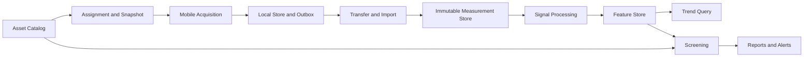

# مدل داده، ذخیره‌سازی و پردازش سیگنال

## مرزهای ماژولی مشترک تمام معماری‌ها



Transport Adapter فقط byte و envelope را جابه‌جا کند. Domain Import مسئول صحت Measurement باشد و Processing Core مستقل از UI و شبکه اجرا شود. برای MVP این مرزها داخل یک برنامه/سرویس کافی‌اند؛ استخراج هر ماژول به Microservice باید دلیل عملی مانند scaling یا مالکیت تیمی مستقل داشته باشد.

## موجودیت‌های اصلی

| موجودیت | فیلدهای کلیدی پیشنهادی | قواعد |
|---|---|---|
| Site / Database | site_id، database_id، authority_id، epoch | جلوگیری از Import به دیتابیس نامربوط |
| AssetNode | node_id، parent_id، node_type، name، revision، deleted_at | ID ثابت، Parent معتبر، بدون چرخه |
| MachineSpecRevision | machine_id/point_id، revision، fields، effective time | نسخه تاریخی؛ ویرایش گذشته را بازنویسی نکند |
| Assignment | assignment_id، scope_id، selected nodes، tree revision | subset مجاز، دریافت context والدها |
| LocalNodeOverride | installation/user، node_id، enabled، order | مستقل از Node مرجع و حفظ در Sync |
| MeasurementSession | session_id، acquisition mode، collector_id، start time | واحد جمع‌آوری و زمینه مشترک |
| Measurement | measurement_id، session_id، point_id nullable، quality، manifest_hash | مشاهده immutable؛ root دارای انتساب معتبر |
| AxisSignal | measurement_id، sensor_axis، direction_id، blob_hash، count | هویت محور و mapping صریح |
| TemperatureReading | measurement_id، value nullable، unit، status، measured_at | خطای دما مستقل از ارتعاش |
| ContextSnapshot | measurement_id، spec_revision، actual_rpm، mapping، calibration | تفسیر زمان برداشت |
| Blob | hash، size، encoding، storage_location، state | immutable و قابل کنترل صحت |
| TransferOutbox | operation_id، measurement_id، target، state، attempts | صف بادوام، بدون نگهداری token در payload عمومی |
| ImportReceipt | measurement_id، content_hash، authority، commit_sequence | مدرک commit و dedup |
| DerivedFeature | measurement_id، axis، algorithm_version، parameters_hash، values | قابل بازسازی؛ جدا از Raw |
| ScreeningResult | measurement_id، ruleset_version، context_hash، severity، evidence | نتیجه تاریخی حفظ شود |
| AuditEvent | actor، entity، operation، before/after refs، reason | اصلاح، حذف منطقی و مجوز قابل پیگیری |

تعریف دقیق مرز Session و Measurement باید بین چهار تیم تثبیت شود. پیشنهاد: هر تلاش Start→Finish یک Session و یک Measurement container با کانال‌های فعال داشته باشد؛ در سنسور تک‌محوره هر تلاش ID تازه می‌گیرد و با `collection_round_id` اختیاری به دور بازرسی وصل می‌شود. `measurement_id` در تمام Transportها هویت اصلی dedup است؛ `session_id` برای provenance و گروه‌بندی حفظ می‌شود. نباید session هر بار Export دوباره ساخته شود.

## چند جزئیات تعیین‌کننده

**Axis با Direction یکی نیست.** X سنسور ممکن است به جهت افقی یا محوری ماشین map شود. mapping شامل axis، direction ID، orientation/sign و نسخه روش نصب باشد. تغییر نصب بعدی داده قبلی را دوباره تفسیر نکند. سنسور تک‌محوره نباید با دو محور صفرشده وانمود کند سه‌محوره بوده است.

**Timestamp هویت نیست.** `measured_at`، `received_at`، timezone offset اولیه، clock source/quality و در صورت دسترسی monotonic sample clock جدا باشند. ترتیب نمونه‌های سیگنال از sample index و sample rate می‌آید؛ از زمان دریافت packet نمی‌آید. در Trend زمان اندازه‌گیری با هشدار ساعت نامطمئن نمایش داده شود، نه اینکه زمان ورود به دسکتاپ جای آن را بگیرد.

**Tag برای انتساب خودکار کافی نیست.** Tag باید در scope کارخانه طبق PRD یکتا باشد؛ Off-root با Tag متنی تا تأیید کاربر Unassigned می‌ماند. جابه‌جایی یا تغییر نام Node هویت تاریخی را عوض نمی‌کند.

**حذف Node، حذف Raw نیست.** soft delete/archive، محدودکردن برداشت جدید و حفظ History را جدا کنید. measurement مربوط به snapshot قدیمی می‌تواند به Node آرشیوی برگردد؛ اگر هویت ناشناخته است در quarantine بماند تا مشکل روشن شود. در این حالت Receipt نهایی قابل Cleanup صادر نشود مگر قرارداد دامنه صراحتاً آرشیو مستقل از mapping را موفق بداند.

## Metadata ضروری سیگنال

- نرخ نمونه، تعداد نمونه واقعی و مورد انتظار، duration، encoding، endian و layout کانال‌ها.
- واحد شتاب، scale/offset کالیبراسیون، سنسور و firmware version، calibration revision.
- anti-aliasing/filter configuration قابل دسترسی، clipping/range، missing sample flags و کیفیت هر محور.
- orientation و Axis Mapping، actual RPM برای ماشین دورمتغیر، روش و زمان ثبت RPM.
- زمان و وضعیت دما، واحد، فاصله زمانی مجاز با ارتعاش؛ tolerance عددی توسط تیم IoT تعیین شود.
- Mode: Root، Free Off-root یا Live Off-root، شناسه User/Collector و Spec snapshot.

Raw Signal و Metadata لازم برای تفسیر آن هر دو داده اصلی‌اند. FFT، Velocity و Overall داده مشتق‌اند؛ انتقال مستقل آن‌ها الزامی نیست. دما از محاسبه FFT بازسازی نمی‌شود و باید واقعاً منتقل شود؛ PRD06 و PRD12 آن را تصریح می‌کنند.

## Local Storage موبایل

برای Root و Free ذخیره‌شدنی: فایل ابتدا در staging نوشته شود، length/hash کنترل و flush شود، سپس Metadata و Outbox در تراکنش محلی ثبت شوند. recovery هنگام آغاز برنامه فایل‌های نیمه‌تمام را از Measurement نهایی جدا کند. وضعیت Saved تنها بعد از موفقیت واقعی ذخیره نمایش داده شود.

فضای لازم قبل از Start تخمین زده شود: Raw + staging + فایل export احتمالی + cache + فضای امن DB. فایل موقت انتقال دوبرابرشدن مصرف را ممکن می‌کند. low-storage cleanup فقط cache مشتق و موارد مجاز را حذف کند؛ داده Root ارسال‌نشده را خودکار حذف نکند.

برای Live Off-root طبق PRD09، ring buffer محدود و بدون آرشیو نهایی؛ log، crash report و cache نباید ناخواسته سیگنال کامل را پایدار کنند. این مسیر با Free Off-root دارای autosave متفاوت است. باقی‌ماندن بعد از restart برای Free طبق PRD08 طراحی می‌شود، ولی مدت retention آن هنوز تصمیم محصول است.

## ذخیره‌سازی دسکتاپ و سایت

در A، SQLite Metadata روی دیسک محلی و Blobها در مسیر مدیریت‌شده برنامه قرار گیرند. schema migration و backup از طریق Core انجام شود. فایل DB باز را با کپی خام نامطمئن backup نکنید؛ سازوکار snapshot/backup سازگار انتخاب شود. در B، PostgreSQL برای metadata مشترک و storage محلی یا object store برای Blob مناسب ارزیابی‌اند.

ساختار پیشنهادی Blob با hash، نه نام ماشین:

```text
store/
  blobs/sha256/ab/cd/<full-hash>
  staging/<transfer-id>/...
  exports/<package-id>.seenora
  receipts/<receipt-id>.json
```

dedup فیزیکی Blob با hash مجاز است، اما دو Measurement با یک سیگنال همسان همچنان دو مشاهده‌اند. GC تنها وقتی فایل را حذف کند که هیچ ارجاع معتبر، transfer فعال یا backup در حال snapshot به آن نیاز نداشته باشد. حذف اشتباه فایل مشترک می‌تواند چند Measurement را خراب کند.

شاخص‌ها: `(site_id, node_id, measured_at, measurement_id)` برای History؛ `(measurement_id, axis, algorithm_version, parameters_hash)` برای Feature؛ `(state, next_attempt_at)` برای صف. برای Trend، تمام Rawها را دوباره scan نکنید؛ Featureهای محاسبه‌شده را query کنید.

## خط لوله DSP

1. validate واحد، sample count، sample rate، calibration و quality هر محور.
2. تبدیل encoding به representation محاسباتی با حفظ Raw اصلی.
3. preprocessing مصوب شامل حذف DC، window و فیلترهای لازم؛ هر پارامتر نسخه‌دار باشد.
4. تولید Time Signal و FFT با تعریف روشن amplitude scaling، resolution و واحد.
5. محاسبه Velocity با روش و band مشخص؛ integration بدون کنترل drift قابل اتکا نیست.
6. محاسبه Envelope و شاخص‌های RMS، Peak-to-Peak، Crest Factor و Kurtosis طبق قرارداد عددی تیم AI.
7. ذخیره Feature با `input_hash + algorithm_version + parameters_hash` و quality.
8. Screening با Rule و Context نسخه‌دار؛ ثبت evidence و علت Insufficient Data.

این متن specification ریاضی نهایی DSP نیست. دامنه فرکانسی، نوع RMS، correction پنجره، روش Envelope و tolerance عددی باید در Reference Dataset تیم AI تثبیت شوند. اشتراک نام FFT در دو کتابخانه تضمین خروجی یکسان نیست.

**پیشنهاد پیاده‌سازی:** هسته محاسباتی portable در صورت توان تیم، یا پیاده‌سازی‌های مجزا با fixture یکسان و tolerance مصوب. wrapperهای Android و Desktop مسئول UI/threading باشند. پردازش سنگین در worker اجرا شود؛ thread رابط کاربر مسدود نشود. نسخه کتابخانه در خروجی ثبت شود.

## Trend و Screening قابل تفسیر

دو نقطه با Node یکسان ولی RPM، فیلتر، واحد یا sample setting متفاوت الزاماً قابل مقایسه نیستند. Trend باید context و quality را نمایش دهد و ruleهایی که به همسانی شرایط وابسته‌اند، از داده ناسازگار نتیجه قطعی نسازند.

قواعد ISO باید با استاندارد، edition، class و شرایط کاربرد منتخب تیم تخصصی پیوند داده شوند؛ این گزارش هیچ threshold عددی یا ادعای انطباق ISO ارائه نمی‌کند. User threshold نسخه‌دار و با تأیید تغییر کند. Similar Machine Comparison باید گروه مقایسه و نسخه تعریف گروه را ثبت کند.

اگر الگوریتم یا Spec عوض شد، Reprocess خروجی جدید بسازد؛ Alert قدیمی overwrite نشود. UI دو حالت قابل تفکیک داشته باشد: «نتیجه ثبت‌شده آن زمان» و «تحلیل مجدد با نسخه فعلی». این تفکیک از PRD02 و PRD15 درباره حفظ تاریخچه پشتیبانی می‌کند.

## اتصال آینده به AI و Support

AI ابری یک consumer اختیاری با opt-in و قرارداد داده مشخص باشد؛ قطع آن Import، Trend و Screening محلی را متوقف نکند. برای نسخه چهار، RAG از metadata و اسناد مجاز استفاده کند و Raw store را به یک دیتابیس برداری تبدیل نکنید؛ index برداری نمایش مشتق قابل بازسازی است.

Support Ticketing طبق PRD16 شامل متن، attachment و تاریخچه وضعیت است. ارسال سیگنال به پشتیبانی اقدام صریح کاربر باشد؛ log عادی نباید Raw کامل یا credential را حمل کند. تیکت، SMS و Draft آفلاین چرخه عمر خودشان را دارند و gate حلقه Root نیستند.