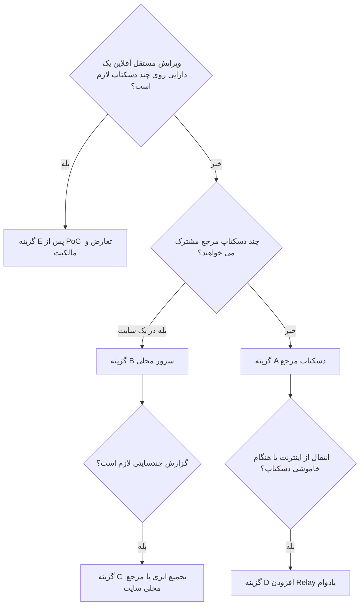

# مقایسه معماری‌های SeeNora v3

این مجموعه برای تصمیم‌گیری معماری و تبدیل نیازمندی‌های موجود به قرارداد قابل پیاده‌سازی تهیه شده است. مبنا، ده فایل Word موجود در پروژه، شامل شانزده PRD و دو نمودار تصویری، است. تاریخ بررسی: ۲۰۲۶-۰۹-۳۰. پروژه در زمان بررسی کد اجرایی یا معماری پیاده‌شده نداشت؛ بنابراین فناوری‌ها، APIها، اعداد ظرفیت و تصمیم‌های زیر **پیشنهاد طراحی** هستند، نه توصیف سامانه فعلی.

پیشنهاد اصلی برای Beta سه‌ماهه: **معماری A، دسکتاپ مرجع با موبایل Offline-first**؛ انتقال با HTTPS در شبکه محلی و بسته فایل در USB، دریافت تغییرات درخت با Pull و ارسال Measurement با Push. اعلان Push فقط به کاهش تأخیر کمک کند. برای چند دسکتاپ فعال در یک کارخانه، **معماری B، سرور محلی سایت** مناسب‌تر است. برای انتقال اینترنتی بدون دسترسی مستقیم به دسکتاپ، Relay معماری D افزوده شود. معماری چندنویسنده E و Vector Clock زمانی توجیه دارند که ویرایش مستقل و آفلاین یک موجودیت روی چند مرجع واقعاً لازم باشد.

## راهنمای مطالعه

| فایل | محتوای اصلی | مخاطب |
|---|---|---|
| [نیازمندی‌ها و ابهام‌ها](01-requirements-and-assumptions.md) | ردیابی اسناد، مرز محصول، تعارض‌ها، قواعد داده | معمار و مدیر محصول |
| [مدل‌های معماری](02-architecture-options.md) | شش گزینه A تا F، نمودار، خرابی‌ها و مسیر رشد | تیم معماری |
| [همگام‌سازی و حل تعارض](03-sync-and-conflicts.md) | Pull، Push، Hybrid، Version، Vector Clock، CRDT | Backend، Android، Desktop |
| [پروتکل موبایل و دسکتاپ](04-mobile-desktop-protocol.md) | Pairing، API، انتقال قابل ادامه، Receipt، USB | تیم‌های پیاده‌سازی |
| [مدل داده و پردازش](05-data-and-processing.md) | Raw Signal، Metadata، Context، DSP، Trend و Screening | IoT، AI، Android، Desktop |
| [مقایسه و تصمیم‌ها](06-comparison-and-decisions.md) | ماتریس وزنی، ADR، هزینه، ظرفیت و مهاجرت | Technical Owner |
| [برنامه اجرا و اعتبارسنجی](07-delivery-and-validation.md) | Gateهای سه‌ماهه، خرابی، امنیت، بازیابی، منابع | توسعه و QA |

## پنج تصمیم پایه

1. Machine Tree و Machine Spec در v3 یک مرجع نوشتن دارند؛ موبایل نسخه محلی و تنظیمات شخصی مسیر را نگه می‌دارد.
2. Raw Measurement تغییرناپذیر است. برداشت مجدد یک Measurement تازه است؛ نام Node، Timestamp یا مقدار سیگنال شناسه رکورد نیستند.
3. موفقیت انتقال یعنی ثبت بادوام داده و Receipt در مرجع نهایی؛ دریافت توسط Relay یا پاسخ ابتدایی HTTP به‌تنهایی کافی نیست.
4. پاک‌سازی فقط شامل Measurementهای موفق و با تأیید کاربر است؛ درخت، تنظیمات محلی و داده‌های ارسال‌نشده باقی می‌مانند.
5. Vector Clock تعارض را تشخیص می‌دهد؛ برای تصمیم معنایی مانند حذف Node یا تغییر RPM باید سیاست محصول و گردش حل تعارض وجود داشته باشد.

## مسیر انتخاب سریع

Pull/Push، متمرکز/توزیع‌شده و Vector Clock سه انتخاب مستقل‌اند: اولی زمان و آغازگر تبادل، دومی محل مالکیت و استقرار، و سومی اطلاعات علیت را مشخص می‌کند. وجود چند موبایل لزوماً به معنی نیاز به پایگاه داده چندمرجعی نیست.

موارد باز مهم: تعداد دسکتاپ‌های نویسنده، تعداد موبایل، نرخ نمونه‌برداری واقعی، بیشترین مدت قطع ارتباط، سیاست Off-root و سیاست خروج داده از کارخانه. جزئیات و فرض‌های موقت در سند اول آمده‌اند؛ هیچ‌یک تصمیم تأییدشده محصول فرض نشده‌اند.
