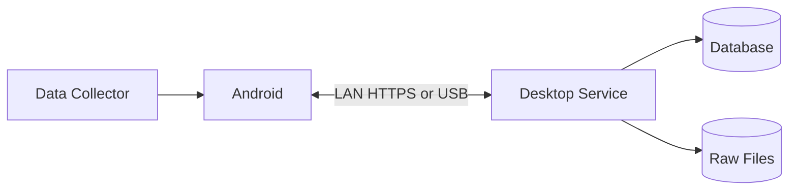
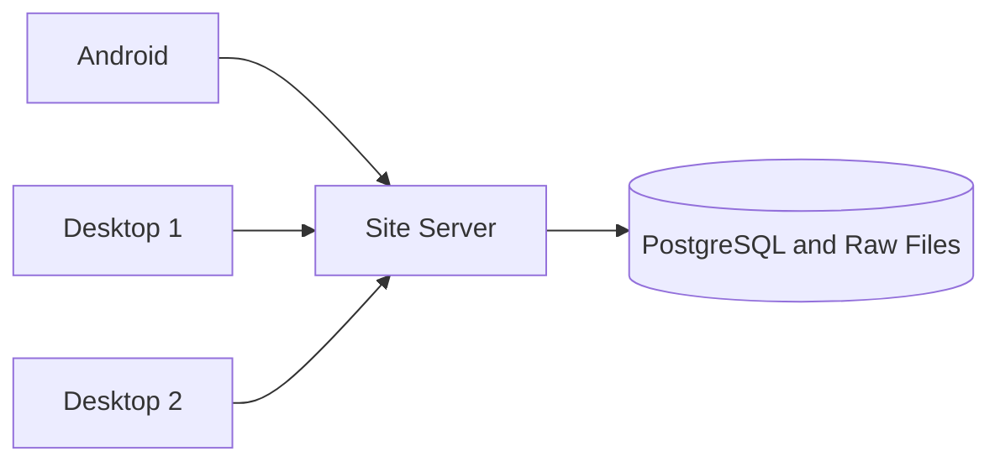

# مقایسه سه روش مدلسازی (ماشین ↔ نقطه)

روش سوم که گفتی یک **مدل درختی (Tree / Hierarchical)** است: یک جدول `nodes` که هر نود میتواند والد داشته باشد و نوعش (ماشین، قطعه، نقطه، جهت، ...) مشخص باشد.

---

## روش ۱: نقاط متعلق به یک ماشین (1-to-Many)

```
machines ──< points
```

**مناسب برای:**
- سیستمهای ساده و ثابت
- هر نقطه فقط و فقط به یک ماشین تعلق دارد
- نام و واحد نقاط بین ماشینها تکرار نمیشود یا اهمیتی ندارد
- تعداد ماشینها و نقاط محدود است
- گزارشگیری ساده (JOIN مستقیم)

**نامناسب برای:**
- وقتی بخواهی بپرسی "کدام ماشینها نقطه X دارند؟"
- وقتی تعریف نقطه مشترک بین چند ماشین باشد

**مثال واقعی:** اپلیکیشن کوچک مانیتورینگ ۱۰ ماشین در یک کارگاه.

---

## روش ۲: نقاط عمومی + جدول واسط (Many-to-Many)

```
machines ──< machine_points >── points
```

**مناسب برای:**
- تعریف نقطه (کد، واحد، بازه مجاز) بین ماشینها **مشترک** است
- میخواهی استانداردسازی کنی (همه ماشینها نقطه `TEMP_01` با واحد `°C` داشته باشند)
- Query پرتکرار: "کدام ماشینها نقطه دما دارند؟"
- الگو/تمپلیت برای انواع ماشین داری

**نامناسب برای:**
- وقتی ساختار سلسلهمراتبی واقعی داری (ماشین → قطعه → نقطه)
- وقتی "جهت" هم باید مدل شود (روش ۲ جهت را خوب پوشش نمیدهد مگر با جدول اضافه)

**مثال واقعی:** سیستم SCADA که ۵۰۰ ماشین دارد و همه نقطه "Oil Pressure" را با یک تعریف مشترک دارند.

---

## روش ۳: درخت نود (Hierarchical / Adjacency List)

```dbml
Table nodes {
  id integer [primary key]
  parent_id integer [ref: > nodes.id]  // self-reference
  node_type varchar  // 'machine' | 'part' | 'point' | 'direction'
  name varchar
  code varchar
  unit varchar
  metadata jsonb
}

// اگر بخواهی به موجودیتهای دیگر وصل شود:
Table node_relations {
  id integer [primary key]
  from_node_id integer [ref: > nodes.id]
  to_node_id integer [ref: > nodes.id]
  relation_type varchar
}
```

ساختار نمونه:

```
Machine A
 ├── Part 1
 │    ├── Point: Temperature (unit: °C)
 │    └── Point: Vibration
 │         └── Direction: X
 │         └── Direction: Y
 └── Part 2
      └── Point: Pressure
```

**مناسب برای:**
- ساختار **واقعاً سلسلهمراتبی**: ماشین → قطعه → نقطه → جهت
- عمق درخت **متغیر** است (بعضی نقاط جهت دارند، بعضی ندارند)
- میخواهی یک مدل **یکپارچه** برای انواع موجودیت داشته باشی
- سیستم **پویا** است و کاربر خودش گره اضافه میکند (مثل Asset Management)
- نیاز به Query بازگشتی (recursive CTE) برای گرفتن زیردرخت داری

**نامناسب برای:**
- Queryهای ساده و پرتکرار (هر SELECT نیاز به recursive CTE دارد)
- وقتی میخواهی Foreign Key واقعی به ماشین/قطعه داشته باشی (اینجا همه چیز `node_id` است)
- گزارشگیری تخت (flat) از دیتابیس
- تیم کوچک یا پروژه ساده (Over-engineering)

**مثال واقعی:** سیستمهای **Asset Hierarchy** مثل Maximo، SAP PM، یا پلتفرمهای IIoT که ماشین → قطعه → سنسور → محور (axis) را نگه میدارند.

---

## جدول تصمیم نهایی

| معیار | روش ۱ | روش ۲ | روش ۳ (درخت) |
|-------|:---:|:---:|:---:|
| سادگی پیادهسازی | ✅✅✅ | ✅✅ | ✅ |
| تعریف مشترک نقاط | ❌ | ✅✅✅ | ✅✅ |
| ساختار سلسلهمراتبی (قطعه/جهت) | ❌ | ❌ | ✅✅✅ |
| عمق متغیر | ❌ | ❌ | ✅✅✅ |
| Query ساده و سریع | ✅✅✅ | ✅✅ | ❌ |
| Foreign Key واقعی | ✅✅✅ | ✅✅ | ❌ |
| انعطاف برای انواع جدید نود | ❌ | ❌ | ✅✅✅ |
| مناسب گزارشگیری تخت | ✅✅✅ | ✅✅ | ✅ |
| مقیاسپذیری در موجودیتهای ناهمگون | ❌ | ✅ | ✅✅✅ |

---

## قانون انتخاب (Rule of Thumb)

1. **اگر نقاط ساده و ثابتاند و جهت نداری** → **روش ۱**
2. **اگر نقاط مشترک بین ماشینها هستند ولی ساختار تخت است** → **روش ۲**
3. **اگر ساختار سلسلهمراتبی داری (ماشین → قطعه → نقطه → جهت) و عمق متغیر است** → **روش ۳**

---

## پیشنهاد عملی: ترکیب روش ۲ و ۳

در پروژههای واقعی IIoT/Asset Management، بهترین حالت اغلب **ترکیبی** است:

```dbml
Table machines {
  id integer [primary key]
  name varchar
}

Table parts {
  id integer [primary key]
  machine_id integer [ref: > machines.id]
  name varchar
}

Table points {
  id integer [primary key]
  part_id integer [ref: > parts.id]
  code varchar
  unit varchar
}

Table directions {
  id integer [primary key]
  point_id integer [ref: > points.id]
  axis varchar  // X, Y, Z
}
```

این ساختار:
- Foreign Key واقعی دارد (سریع و قابل اعتماد)
- سلسلهمراتب را حفظ میکند
- Queryهای تخت سادهاند
- برای قطعات/نقاط/جهت جدول جدا دارد → constraints واقعی

**درخت (روش ۳) را فقط وقتی انتخاب کن که:**
- انواع نودها در زمان اجرا اضافه میشوند، یا
- عمق درخت واقعاً نامحدود و متغیر است، یا
- میخواهی یک سیستم Generic Asset نگه داری (مثل Maximo).


# گزینه‌های معماری

## گزینه A: Desktop مرجع



Desktop مرجع Tree و Measurement History است. موبایل در زمان قطع ارتباط کار می‌کند و بعداً Sync می‌شود.

مزایا:

- ساده‌ترین گزینه برای MVP
- نصب و پشتیبانی کم‌هزینه‌تر
- بدون نیاز اجباری به Cloud
- نزدیک به PRDهای فعلی

محدودیت: وقتی PC خاموش است، انتقال مستقیم شبکه‌ای انجام نمی‌شود و داده در موبایل می‌ماند.

## گزینه B: سرور محلی کارخانه



یک سرور همیشه‌روشن در کارخانه مرجع داده است و Desktopها کلاینت آن هستند.

مزایا:

- مناسب چند Desktop و چند تکنسین
- Backup و دسترسی مشترک ساده‌تر
- خاموش‌بودن PC کارشناس مانع دریافت داده نیست

محدودیت: سرور، UPS، Backup و مسئول IT لازم دارد.

## گزینه C: Desktop با واسطه Cloud

Android فایل را به Relay ابری می‌فرستد و Desktop بعداً آن را دریافت می‌کند. Cloud در این مدل فقط واسطه است.

این گزینه وقتی لازم است که موبایل از اینترنت همراه ارسال کند یا Desktop پشت NAT باشد. دریافت فایل توسط Cloud به معنی ثبت نهایی در Desktop نیست؛ موبایل تا Receipt نهایی داده را حذف نمی‌کند.

## گزینه D: چندمرجعی توزیع‌شده

چند Desktop می‌توانند آفلاین یک Tree را ویرایش و بعداً تغییرات را ادغام کنند. این مدل به Vector Clock، Conflict UI و قواعد پیچیده Merge نیاز دارد.

برای v3 پیشنهاد نمی‌شود، چون نیاز فعلی چند جمع‌آورنده Measurement است، نه چند نویسنده مستقل Tree.

## انتخاب پیشنهادی

| شرایط کارخانه | انتخاب |
|---|---|
| یک PC مرجع | گزینه A |
| چند Desktop یا PC مرجع همیشه خاموش می‌شود | گزینه B |
| ارسال از اینترنت همراه لازم است | A یا B همراه Relay |
| چند نویسنده آفلاین Tree واقعاً لازم است | گزینه D پس از PoC |


# ارتباط Android و Desktop براساس PRD 03

## پیشنهاد کوتاه

برای انتقال Tree از این روش استفاده شود:

1. کاربر در Desktop یک Branch یا چند Direction را انتخاب می‌کند.
2. Desktop یک Assignment نسخه‌دار می‌سازد.
3. Android با اسکن QR به Desktop متصل می‌شود.
4. Android بسته Assignment را با HTTPS دریافت می‌کند.
5. بسته در یک تراکنش محلی Import می‌شود.
6. UUIDهای قبلی Update و UUIDهای جدید Insert می‌شوند.
7. تنظیمات محلی `enabled/order` دست‌نخورده باقی می‌مانند.

از دید کاربر انتقال «Desktop به Mobile» است، اما بهتر است اتصال شبکه را Android آغاز کند. این کار مشکل IP موبایل، Firewall و اتصال ورودی به گوشی را حذف می‌کند.

## مقایسه پروتکل‌ها

| روش | نتیجه |
|---|---|
| HTTPS REST روی LAN | پیشنهاد اصلی؛ ساده، قابل تست و مناسب Retry |
| WebSocket | فقط برای نمایش لحظه‌ای وضعیت؛ برای Tree لازم نیست |
| MQTT | برای این انتقال کوچک Broker اضافه می‌کند و ارزش کافی ندارد |
| Bluetooth | برای Data Collector مناسب‌تر است؛ Sync Desktop را پیچیده می‌کند |
| USB Package | مسیر جایگزین رسمی برای سایت بدون شبکه |
| Cloud Relay | فقط اگر انتقال از اینترنت همراه لازم باشد |

## Pairing

Desktop یک QR کوتاه‌عمر نشان می‌دهد که شامل این اطلاعات است:

```json
{
  "authority_id": "desktop-uuid",
  "address": "https://192.168.10.20:7443",
  "pairing_code": "one-time-code"
}
```

QR نباید Tree، رمز دائمی یا Raw Data داشته باشد. Android پس از Pairing یک شناسه نصب و credential محدود به همان کارخانه دریافت می‌کند.

اگر Certificate عمومی در LAN ممکن نیست، Installer باید Certificate محلی بسازد و اثرانگشت آن از طریق QR تأیید شود. خاموش‌کردن TLS validation راه‌حل قابل قبول نیست.

## API ساده نسخه اول

| درخواست | کاربرد |
|---|---|
| `GET /api/v1/capabilities` | نسخه پروتکل و قابلیت‌های Desktop |
| `POST /api/v1/pair` | ثبت موبایل با کد یک‌بارمصرف |
| `GET /api/v1/assignments` | فهرست مأموریت‌های آماده این موبایل |
| `GET /api/v1/assignments/{id}` | دریافت Tree، Spec و تنظیمات مأموریت |
| `POST /api/v1/assignments/{id}/ack` | اعلام Import موفق یا خطا |

همین Assignment در USB نیز به‌صورت فایل `.seenora-tree` Export می‌شود. شبکه و USB باید از یک Importer مشترک استفاده کنند.

## محتوای Assignment

```json
{
  "schema_version": 1,
  "assignment_id": "uuid",
  "factory_id": "uuid",
  "authority_id": "uuid",
  "tree_revision": 42,
  "created_at": "2026-10-01T08:00:00Z",
  "nodes": [
    {
      "id": "node-uuid",
      "parent_id": "parent-uuid",
      "type": "MEASUREMENT_DIRECTION",
      "name": "Horizontal",
      "revision": 7,
      "deleted_at": null
    }
  ],
  "specs": [],
  "package_sha256": "..."
}
```

تمام Parentهای لازم برای نمایش مسیر باید داخل بسته باشند، حتی اگر فقط یک Machine انتخاب شده باشد. تصاویر بزرگ می‌توانند جداگانه و اختیاری منتقل شوند.

## Import روی Android

Android ابتدا بسته را در Staging نگه می‌دارد و سپس این مراحل را انجام می‌دهد:

1. بررسی نسخه Schema، Factory، Authority و hash بسته.
2. بررسی وجود Parentها و نبود چرخه.
3. Upsert تمام Nodeها با UUID اصلی Desktop.
4. اعمال Tombstoneهای صریح.
5. ساخت یا Update مأموریت و ترتیب Directionها.
6. Commit همه تغییرات در یک تراکنش Room/SQLite.
7. ثبت `tree_revision` فقط پس از Commit موفق.

اگر Import قطع شود، نسخه فعال قبلی باقی می‌ماند. Import نیمه‌کاره نباید در UI دیده شود.

## حفظ تنظیم کاربر

تنظیم محلی در جدولی جدا و با کلید `mobile + measurement_node_id` ذخیره می‌شود:

```text
is_enabled
local_sort_order
last_measured_at
```

این ردیف با Update Node جایگزین نمی‌شود. اگر Node واقعاً حذف شده باشد، Preference می‌تواند برای مدتی باقی بماند تا Measurementهای قدیمی همچنان قابل نمایش باشند.

## Full Package یا Delta؟

برای MVP، ارسال کامل Branch انتخاب‌شده پیشنهاد می‌شود. Tree نسبت به Raw Signal کوچک است و پیاده‌سازی Full Package ساده‌تر و مطمئن‌تر است.

Delta زمانی اضافه شود که اندازه Tree یا زمان Import واقعاً مشکل ایجاد کند. Delta شامل `base_revision`، Nodeهای تغییرکرده و Tombstoneهای صریح است. نبودن یک Node در بسته به معنی حذف آن نیست.

## خطاهای مهم

| خطا | رفتار |
|---|---|
| قطع شبکه | بسته ناقص فعال نشود؛ Retry از ابتدا برای بسته کوچک |
| دریافت دوباره همان Assignment | Upsert؛ بدون Duplicate |
| نسخه قدیمی Android | پیام ناسازگاری Schema؛ Tree قبلی حفظ شود |
| فضای ناکافی | Import انجام نشود و مقدار فضای لازم نمایش داده شود |
| Parent ناموجود | کل بسته رد شود |
| Node حذف‌شده با Measurement قدیمی | Soft Delete؛ Measurement حفظ شود |
| Factory یا Authority اشتباه | بسته رد شود |

## UX پیشنهادی

Desktop:

```text
Select Branch -> Show machine/point counts -> Choose Mobile -> Create Assignment -> Show QR/status
```

Android:

```text
Scan/Connect -> Show assignment summary -> Download -> Import -> Ready
```

وضعیت‌های قابل نمایش: `Waiting`, `Downloading`, `Validating`, `Imported`, `Failed`. پیام خطا باید اقدام بعدی مثل Retry، آزادکردن فضا یا Update برنامه را بگوید.

## نتیجه پذیرش PRD 03

این طراحی تضمین می‌کند Parent/Child و UUID حفظ شوند، Branch محدود منتقل شود، Import مجدد Duplicate نسازد، Tree بعد از Restart موجود باشد، Update داده قبلی را حذف نکند و تنظیم فعال/غیرفعال تکنسین با Sync بعدی تغییر نکند.
