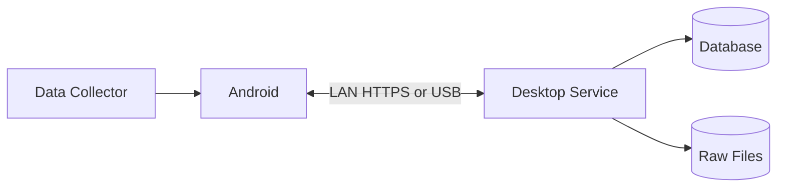
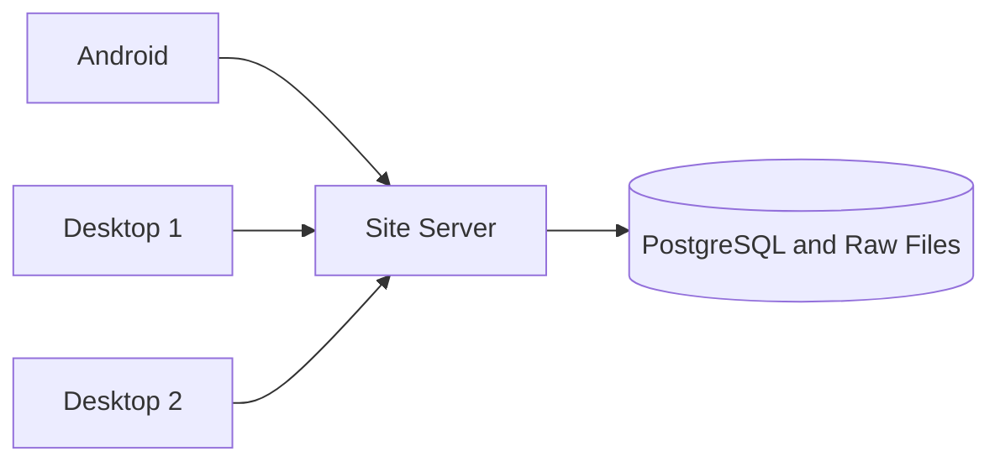

# گزینه‌های معماری

## گزینه A: Desktop مرجع

Desktop مرجع Tree و Measurement History است. موبایل در زمان قطع ارتباط کار می‌کند و بعداً Sync می‌شود.

مزایا:

- ساده‌ترین گزینه برای MVP
- نصب و پشتیبانی کم‌هزینه‌تر
- بدون نیاز اجباری به Cloud
- نزدیک به PRDهای فعلی

محدودیت: وقتی PC خاموش است، انتقال مستقیم شبکه‌ای انجام نمی‌شود و داده در موبایل می‌ماند.

## گزینه B: سرور محلی کارخانه

یک سرور همیشه‌روشن در کارخانه مرجع داده است و Desktopها کلاینت آن هستند.

مزایا:

- مناسب چند Desktop و چند تکنسین
- Backup و دسترسی مشترک ساده‌تر
- خاموش‌بودن PC کارشناس مانع دریافت داده نیست

محدودیت: سرور، UPS، Backup و مسئول IT لازم دارد.

## گزینه C: Desktop با واسطه Cloud

Android فایل را به Relay ابری می‌فرستد و Desktop بعداً آن را دریافت می‌کند. Cloud در این مدل فقط واسطه است.

این گزینه وقتی لازم است که موبایل از اینترنت همراه ارسال کند یا Desktop پشت NAT باشد. دریافت فایل توسط Cloud به معنی ثبت نهایی در Desktop نیست؛ موبایل تا Receipt نهایی داده را حذف نمی‌کند.

## گزینه D: چندمرجعی توزیع‌شده

چند Desktop می‌توانند آفلاین یک Tree را ویرایش و بعداً تغییرات را ادغام کنند. این مدل به Vector Clock، Conflict UI و قواعد پیچیده Merge نیاز دارد.

برای v3 پیشنهاد نمی‌شود، چون نیاز فعلی چند جمع‌آورنده Measurement است، نه چند نویسنده مستقل Tree.

## انتخاب پیشنهادی

| شرایط کارخانه | انتخاب |
|---|---|
| یک PC مرجع | گزینه A |
| چند Desktop یا PC مرجع همیشه خاموش می‌شود | گزینه B |
| ارسال از اینترنت همراه لازم است | A یا B همراه Relay |
| چند نویسنده آفلاین Tree واقعاً لازم است | گزینه D پس از PoC |
