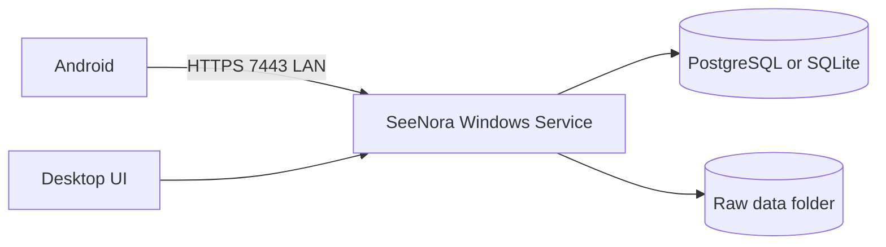
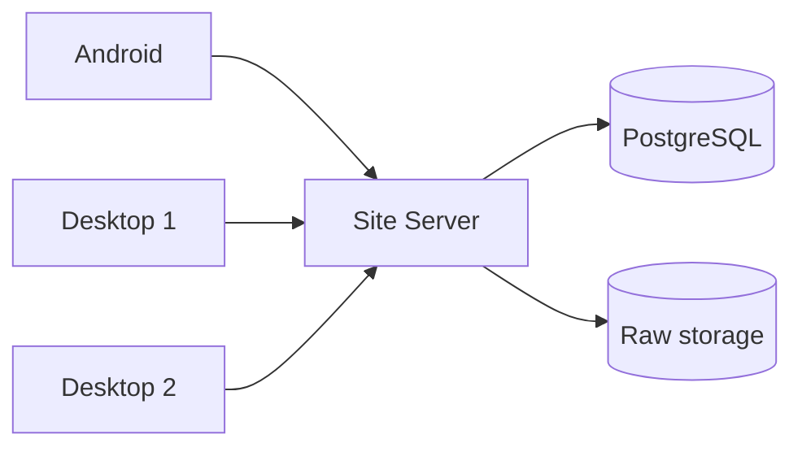

# استقرار Desktop و تست سامانه

## سه روش واقعی استقرار

### ۱. برنامه EXE معمولی

کاربر برنامه را اجرا می‌کند و با بسته‌شدن UI، سرویس ارتباط Android هم بسته می‌شود. این روش فقط برای Demo مناسب است؛ چون دریافت شبکه‌ای به بازبودن برنامه وابسته می‌شود.

### ۲. Installer به همراه Windows Service

Installer این اجزا را نصب می‌کند:

```text
SeeNora Desktop UI
SeeNora Background Service
Database
Raw data folder
Certificate and firewall rule
Backup/update tools
```

UI برای کاربر است و Background Service همیشه اجرا می‌شود. در نتیجه Android می‌تواند حتی وقتی پنجره Desktop بسته است Tree بگیرد یا Measurement ارسال کند. خود PC باید روشن باشد.

این روش پیشنهاد اصلی برای یک کامپیوتر ویندوزی در کارخانه است. Microsoft نیز اجرای Worker به‌صورت Windows Service و انتشار آن به شکل executable را پشتیبانی می‌کند: [راهنمای Windows Service](https://learn.microsoft.com/en-us/dotnet/core/extensions/windows-service) و [ساخت Installer](https://learn.microsoft.com/en-us/dotnet/core/extensions/windows-service-with-installer).

### ۳. Docker Compose

Backend، PostgreSQL و در صورت نیاز UI در Containerهای جدا اجرا می‌شوند:

```text
compose
  seenora-api
  postgresql
  optional reverse-proxy
```

Docker Compose برای یک سرور محلی تحت مدیریت IT گزینه خوبی است و Docker آن را برای استقرار single-host نیز مستند کرده است: [Compose single-host](https://docs.docker.com/compose/intro/features-uses/) و [Production Compose](https://docs.docker.com/compose/how-tos/production/).

## مقایسه

| معیار | Installer + Windows Service | Docker Desktop روی Windows | Docker Engine روی سرور Linux |
|---|---|---|---|
| مناسب کاربر عادی کارخانه | بسیار مناسب | ضعیف | نیازمند IT |
| نصب اولیه | یک Setup | Docker + WSL2/virtualization + Compose | آماده‌سازی Server + Compose |
| اجرای خودکار بعد از Restart | Windows Service | تنظیمات Docker و Container | systemd + restart policy |
| مصرف منابع | کمتر | بیشتر به‌خاطر VM/WSL | مناسب سرور |
| عیب‌یابی توسط پشتیبانی عمومی | ساده‌تر | سخت‌تر | مناسب تیم DevOps |
| جداسازی وابستگی‌ها | متوسط | خوب | خوب |
| Update آفلاین | Installer امضاشده | Imageهای آفلاین لازم است | Imageهای آفلاین لازم است |
| Backup | ابزار خود برنامه | Volumeها و DB | Volumeها و DB |
| چند سرویس و چند Desktop | محدود | ممکن ولی نامناسب Workstation | مناسب |
| نتیجه | پیشنهاد تک‌PC | پیشنهاد نمی‌شود | پیشنهاد Site Server |

Docker Desktop روی Windows پیش‌نیازهای Windows/WSL2 و Virtualization دارد که در PC صنعتی ممکن است فعال نباشند؛ [پیش‌نیازهای رسمی Windows](https://docs.docker.com/desktop/setup/install/windows-install/) باید روی سخت‌افزار مقصد بررسی شوند. شرایط استفاده تجاری Docker Desktop نیز باید با [صفحه مجوز رسمی](https://docs.docker.com/subscription/desktop-license/) تطبیق داده شود. این مسئله درباره Docker Engine روی سرور Linux همان شکل را ندارد.

## پیشنهاد استقرار SeeNora

### حالت یک Desktop در کارخانه



از Installer ویندوز استفاده شود. Data در مسیر مستقل مانند `C:\ProgramData\SeeNora` قرار گیرد و با uninstall برنامه پاک نشود. Service با دسترسی محدود اجرا شود و فقط روی شبکه Private و پورت مشخص Listen کند.

SQLite برای Pilot تک‌ماشین ساده‌تر است. اگر چند Process، چند Desktop یا رشد به Site Server محتمل است، PostgreSQL از ابتدا انتخاب بهتری است.

### حالت چند Desktop



یک سرور محلی همیشه‌روشن داشته باشید. اگر IT کارخانه Linux و Docker را پشتیبانی می‌کند، Docker Engine + Compose انتخاب مناسبی است. Desktopها فقط UI/Client نصب می‌کنند.

## نصب و Update در حالت EXE

Installer باید این کارها را انجام دهد:

1. بررسی نسخه Windows و فضای دیسک.
2. نصب UI و Service.
3. ساخت پوشه داده با Permission مناسب.
4. ساخت Certificate و Pairing اولیه.
5. ایجاد Firewall Rule فقط برای شبکه محلی مورد نیاز.
6. راه‌اندازی Service با Automatic Start.
7. اجرای Health Check.
8. ثبت Uninstaller بدون حذف خودکار داده مشتری.

Update:

```text
Health check -> backup -> stop service -> install -> migrate DB -> start -> verify
```

Migration باید نسخه‌دار باشد. اگر Migration شکست خورد، نسخه قبلی برنامه و Backup قابل بازیابی باشند. Installer نباید Raw Data را همراه فایل برنامه نگه دارد.

## نصب و Update در Docker

Compose production باید Volume پایدار، Health Check، Restart Policy، محدودیت Port و نسخه ثابت Image داشته باشد. `latest` برای نصب کارخانه مناسب نیست.

```text
load signed images offline
backup database and volumes
docker compose up -d
run migration
health check
```

حذف Container نباید داده را حذف کند. Backup فقط کپی Volume باز نیست؛ PostgreSQL باید Backup سازگار خودش را داشته باشد و Raw Files نیز در همان نقطه زمانی پوشش داده شوند.

## تست‌های ضروری قبل از Pilot

| سناریو | نتیجه قابل قبول |
|---|---|
| UI بسته و Service روشن | Android همچنان به API متصل شود |
| Restart ویندوز/سرور | Service و DB خودکار بالا بیایند |
| قطع شبکه وسط Tree Transfer | Tree قبلی باقی بماند و Retry ممکن باشد |
| دریافت دوباره Assignment | Duplicate ساخته نشود |
| Update Tree با Measurement قدیمی | Measurement حذف یا جابه‌جا نشود |
| قطع شبکه وسط Measurement Upload | داده موبایل باقی بماند |
| Commit موفق و پاسخ گم‌شده | Retry همان Receipt را بگیرد |
| دیسک مقصد پر | موفقیت کاذب اعلام نشود |
| Restore Backup | Tree، Raw، Receipt و Trend قابل بازیابی باشند |
| Update نرم‌افزار | Schema قدیمی بدون حذف داده مهاجرت کند |

## جمع‌بندی استقرار

- MVP روی یک PC ویندوز: Installer + Windows Service.
- چند کاربر و سرور تحت مدیریت IT: Docker Engine + Compose روی Linux یا نصب native سرور.
- Docker Desktop روی PC اپراتور: فقط برای توسعه یا شرایطی که IT آن را رسماً پشتیبانی می‌کند.
- EXE بدون Service: فقط Demo، نه استقرار نهایی کارخانه.
